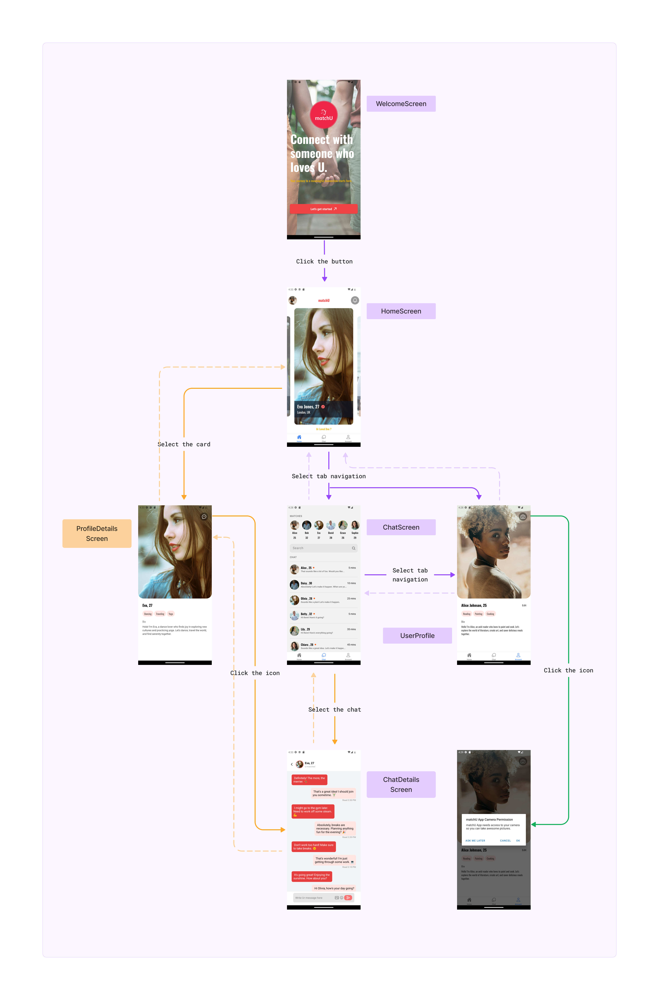

# Project Title
matchU // Dating App



## Table of Contents
- [Introduction](#introduction)
- [Features](#features)
- [Getting Started](#getting-started)
  - [Prerequisites](#prerequisites)
  - [Installation](#installation)
- [Contributing](#contributing)
- [License](#license)

## Introduction
I created a fictitious dating app using React Native, aiming to deepen my understanding of the framework's functionalities and structures. The project was inspired by the tutorial [https://www.youtube.com/watch?v=x9XbqVbzET8](https://www.youtube.com/watch?v=x9XbqVbzET8), and I focused on building the frontend side of the application.

## Features
- Utilizes React Navigation, incorporating a stack navigator and a bottom tab navigator with Ionicons for tab icons.
- Features a Card Component with a carousel for user profiles, displaying details like name, age, city, and country.
- Implements a Chat list with user avatars and additional details.
- Displays a horizontal scroll view for the chat screen, showcasing user matches.
- Message list includes dynamic styling based on the sender, enhancing visual distinction.
- Leverages the datesData constant for mock data.

## Getting Started
To get started with the Fictitious Dating App project using Expo, follow these steps:

### Prerequisites
Make sure you have the following software installed on your machine:

- Node.js
- npm (Node Package Manager)
- Expo CLI

### Installation
1. Clone the repository:
    ```bash
    git clone https://github.com/kotobamania/matchU.git
    ```
2. Change into the project directory:
    ```bash
    cd matchU
    ```
3. Start the Expo development server:
    ```bash
    npm install
    ```
4. Start the Expo development server:
    ```bash
    expo start
    ```
Feel free to choose the version that aligns better with your communication style or the level of detail you want to provide.

### Contributing
Thank you for your interest in the fictitious dating app Site project. As this project is primarily a personal practice and portfolio piece, I currently don't have specific guidelines for external contributions. Feel free to explore the code, provide feedback, or use it as inspiration for your own projects.

If you have any questions or suggestions, I'd be happy to hear from you. You can contact me at [kotobamania@gmail.com].

### License
This project is licensed under the kotobamani - see the [LICENSE.md] file for details.
